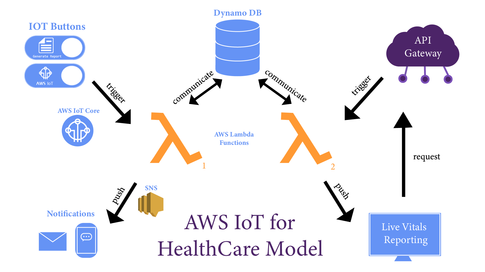

  

A repository contains the front end code for a web app hosting the AWS IoT for Healthcare Development research at TCU. This research aims to showcase the power of AWS as a notification and database system for healthcare applications.

## Virtual IoT Button

A virtual display button that functions as an AWS IoT button, alerting a healthcare professional that you need attention or that you are having an emergency, depending on the length you press the button. 

## Virtual Vitals Panel
A simple display panel that shows the vital signs of a *patient* in real time. Values are also recorded in the DynamoDB database are alerts are sent out to a mobile device as a demonstration of a alert a health care professional should the vitals reach an abnormal level.

## Alexa Gets Involved
To be Implemented soon!

We are working with Alexa devices to add more functionality using AWS to healthcare providers. Hospitals with Amazon Alexa devices allows for functionality and confort, giving medical staff ways to monitor patients and be alerted should they need personal attention.
